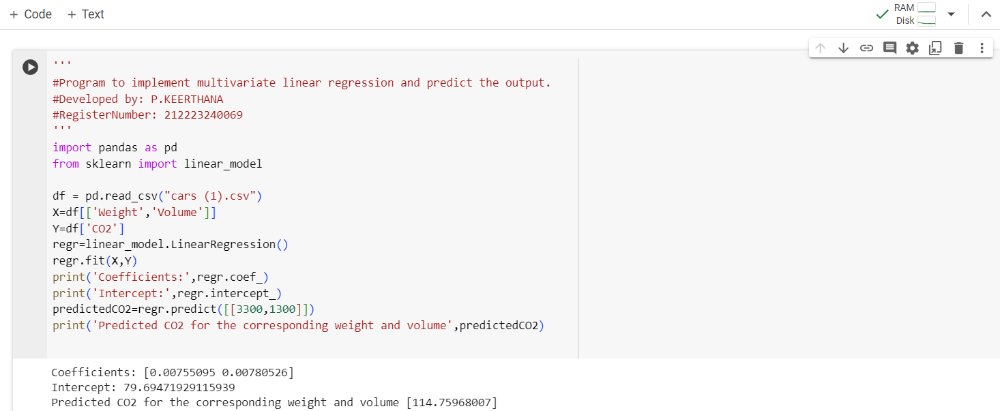

# Implementation of Multivariate Linear Regression
## Aim
To write a python program to implement multivariate linear regression and predict the output.
## Equipment’s required:
1.	Hardware – PCs
2.	Anaconda – Python 3.7 Installation / Moodle-Code Runner
## Algorithm:

### Step1
Import Pandas library.
### Step2
Import Linear_model from sklearn.
### Step3
Read the csv file using pandas library.
### Step4
Enter the parameters of the linear function.
### Step5
Print the parameters of the linear function.
## Program:
```
'''
#Program to implement multivariate linear regression and predict the output.
#Developed by: P.KEERTHANA
#RegisterNumber: 212223240069
'''
import pandas as pd
from sklearn import linear_model

df = pd.read_csv("cars (1).csv")
X=df[['Weight','Volume']]
Y=df['CO2']
regr=linear_model.LinearRegression()
regr.fit(X,Y)
print('Coefficients:',regr.coef_)
print('Intercept:',regr.intercept_)
predictedCO2=regr.predict([[3300,1300]])
print('Predicted CO2 for the corresponding weight and volume',predictedCO2)

```
## Output:

### Insert your output



## Result
Thus the multivariate linear regression is implemented and predicted the output using python program.